# LANL Threat Prediction Pipeline

**Course:** Distributed Computing for Data Science (Project 2)
**Team:** Mark Crisci
**Live application URL:** https://lanlthreat.streamlit.app
**API endpoint:**         http://98.94.30.68:8000
**Smoke test:**           `python test_project.py --url http://98.94.30.68:8000`
**One-page write-up:**    [`WRITEUP.pdf`](WRITEUP.pdf) (rebuild with `python scripts/generate_writeup_pdf.py`)
**Deploy guide:**         [`deploy/README.md`](deploy/README.md)

---

## What this project does

This is an **end-to-end distributed data pipeline** that ingests the Los Alamos
National Laboratory (LANL) multi-source enterprise telemetry dataset, transforms
it through a medallion architecture on AWS, trains a machine-learning model with
**MLflow** tracking and registry, and serves predictions through a polished
**Streamlit** web app backed by a **FastAPI** service.

### The prediction question
> Given a computer's behavior in the **current** event-time window (authentication,
> network flows, DNS, process events), will the same computer show **red-team
> activity in the next window**?

The model predicts the **future** window, not the current one, with the
current-window red-team columns explicitly stripped from the feature set. That
is what keeps the evaluation honest.

---

## Architecture (which stages are distributed)

The project specification requires at least **two** of the four pipeline layers
to use distributed/cloud infrastructure. This project uses **three**:

| Layer | Technology | Distributed? |
|---|---|---|
| **Ingestion / Storage (raw)** | LANL `.txt.gz` files in **S3** (`s3://<bucket>/lanl/bronze`) | yes - cloud object store |
| **Transformation (bronze -> silver, silver -> gold)** | **PySpark on AWS EMR** via `jobs/bronze_to_silver_emr.py` and `jobs/silver_to_gold_emr.py` | yes - distributed compute |
| **Storage (clean / model-ready)** | **Parquet** on S3 (`silver/`, `gold/`), partitioned by event-day bucket | yes - cloud columnar format |
| **Model training + tracking** | scikit-learn + **MLflow** (tracking server + Model Registry, alias `Production`) | yes - tracked experiments |
| **Serving** | **FastAPI** on **EC2** (counts as the "Flask/FastAPI on EC2" option in the spec) | yes - cloud backend |
| **UI** | Streamlit (on Streamlit Cloud, EC2, or Hugging Face Spaces) | hosted |

Why an AWS-first stack rather than Databricks? Databricks free-tier restrictions
blocked stable writable storage on this dataset's volume. AWS S3 + EMR preserves
the distributed architecture the rubric requires while giving direct control
over the storage layer.

```mermaid
flowchart LR
    R["LANL raw .txt.gz<br/>auth · flows · dns · proc · redteam"]
    B[("S3 — bronze<br/>raw landing")]
    EMR1["EMR PySpark<br/>bronze_to_silver_emr.py<br/><i>schemas · typing · cleanup</i>"]
    S[("S3 — silver<br/>typed parquet per source")]
    EMR2["EMR PySpark<br/>silver_to_gold_emr.py<br/><i>time windows · aggregates · future-window target</i>"]
    G[("S3 — gold<br/>(computer, time_window) features")]
    T["train_model.py<br/>+ MLflow tracking + Model Registry alias <b>Production</b>"]
    A["FastAPI on EC2<br/>/health /model_info /features /predict /batch_predict"]
    U["Streamlit UI<br/>presets · gauge · metrics · architecture"]
    R --> B --> EMR1 --> S --> EMR2 --> G --> T --> A --> U

    classDef cloud fill:#e0f2fe,stroke:#0369a1,color:#0c4a6e;
    classDef compute fill:#fef3c7,stroke:#b45309,color:#7c2d12;
    classDef serve fill:#dcfce7,stroke:#15803d,color:#14532d;
    class B,S,G cloud
    class EMR1,EMR2 compute
    class A,U serve
```



The blue boxes are the **distributed storage** layer (S3 parquet), the
amber boxes are the **distributed compute** layer (Spark on EMR), and the
green boxes are the **cloud serving** layer (FastAPI on EC2 + Streamlit
hosting). That is **three** of the four pipeline layers using cloud or
distributed infrastructure — the spec only requires two.

A more detailed walkthrough lives in [`docs/ARCHITECTURE.md`](docs/ARCHITECTURE.md).

---

## Repository layout

```
LANL/
  config/
    settings.py            # single source of truth: S3 paths, window size, leakage cols
    schemas.py             # explicit Spark schemas + row-grain notes per source
  jobs/
    bronze_to_silver_emr.py  # EMR Spark: raw -> typed, cleaned silver parquet
    silver_to_gold_emr.py    # EMR Spark: silver -> aggregated (computer, time_window) gold
    train_model.py           # gold -> sklearn pipeline + MLflow tracking + registry
  utils/
    spark_dq.py            # reusable Spark-native data-quality checks
  app/
    api_app.py             # FastAPI /health /model_info /features /predict /batch_predict
    streamlit_app.py       # Streamlit UI (presets, verdict card, metrics, arch tabs)
  tests/
    test_project.py        # local-dev copy of the smoke test
  docs/
    WRITEUP.md             # one-page write-up (rendered to PDF for submission)
    ARCHITECTURE.md        # detailed pipeline + design-decision walkthrough
    PRESENTATION.md        # slide deck + speaker script
  scripts/
    generate_writeup_pdf.py  # converts docs/WRITEUP.md to WRITEUP.pdf
  deploy/
    launch_emr.sh          # AWS CLI: create transient EMR cluster + submit both steps
    Dockerfile             # serving container (FastAPI + trained model)
    docker-compose.yml     # one-command API + UI on a single host
    README.md              # deploy guide (cloud path + single-host path)
  .github/workflows/
    ci.yml                 # CI: train + start API + run test_project.py + render PDF
  test_project.py          # **graded smoke test (repo root, per spec)**
  WRITEUP.pdf              # **one-page write-up (repo root, per spec)**
  run_local_demo.py        # offline verification harness (NOT the canonical path)
  requirements.txt
  .gitignore
  README.md
```

---

## How to run

### A. Cloud path (the real graded pipeline)

1. Upload the LANL raw files (`auth.txt.gz`, `flows.txt.gz`, `dns.txt.gz`,
   `proc.txt.gz`, `redteam.txt.gz`) to `s3://<bucket>/lanl/bronze/`.
2. Launch an EMR cluster with PySpark.
3. Submit the bronze-to-silver job:
   ```
   spark-submit jobs/bronze_to_silver_emr.py
   ```
4. Submit the silver-to-gold job:
   ```
   spark-submit jobs/silver_to_gold_emr.py
   ```
5. Train the model (locally on an EC2 box or in EMR):
   ```
   python -m jobs.train_model
   ```
6. Start the API:
   ```
   uvicorn app.api_app:app --host 0.0.0.0 --port 8000
   ```
7. Start the UI:
   ```
   streamlit run app/streamlit_app.py
   ```

### B. Offline verification (laptop, NOT the canonical pipeline)

This path exists so a grader can confirm the model + API + test script work
without spinning EMR back up. It uses the small `gold_outputs/gold_computer_time_sample.csv`
that ships with the repo.

```
pip install -r requirements.txt
python run_local_demo.py
```

`run_local_demo.py` will (1) train with `LANL_USE_LOCAL_GOLD=1`, (2) start the
API, (3) run `test_project.py`, and (4) shut the API back down.

---

## Running the graded test script

```
python test_project.py                                # local
python test_project.py --url https://<your-host>      # against the graded URL
```

Expected output:
```
Smoke test target: ...
  [ok] /health      -> random_forest_model
  [ok] /model_info  -> random_forest_model  (10 metrics)
  [ok] /features    -> 41 feature names
  [ok] /predict     -> class=0  P(redteam_next)=0.0432
  [ok] /predict (sparse payload) handled correctly
  [ok] /predict (flat legacy payload) handled correctly

PASS: all checks succeeded.
```

Exit code is `0` on success and `1` on any failure (per spec).

### Cold-start note for graders
The Streamlit Cloud / Hugging Face Spaces hosting tier sleeps the app after
inactivity. The first request may take ~30 s to wake the dyno. Subsequent
requests are immediate.

---

## Predictive model + MLflow

- **Models trained:** logistic regression (baseline) and random forest (stronger).
- **Selection metric:** validation F1 (with PR AUC fallback for the rare case
  the positive class is missing from a split).
- **Tracking:** every run is logged to MLflow with metrics, parameters,
  leakage-column metadata, and the pipeline artifact.
- **Registry:** the winning version is registered under
  `lanl_threat_predictor` and tagged with alias **`Production`**.
- **Metrics reported:** precision, recall, F1, ROC AUC, PR AUC, on a
  time-aware 60 / 20 / 20 split (no random shuffling).

The FastAPI service loads `model_outputs/<best>/<best>.joblib` and exposes:

```
GET  /health         liveness + model loaded
GET  /model_info     model name + metrics
GET  /features       feature contract
POST /predict        single row
POST /batch_predict  many rows
```

---

## Security

- AWS keys, Databricks tokens, and any secrets stay out of git
  (see [`.gitignore`](.gitignore)). The pipeline reads paths from
  `config/settings.py`, which itself reads from environment variables.
- The Streamlit UI never calls AWS directly - everything goes through the
  FastAPI service so credentials live on the server, not the browser.

---

## Originality

This is an original concept built from scratch on the LANL multi-source
dataset. It is not a port of a tutorial, course example, or public demo.
The signature design decision - predicting **next**-window red-team activity
with the current-window red-team columns explicitly removed - is the
project's own framing.
